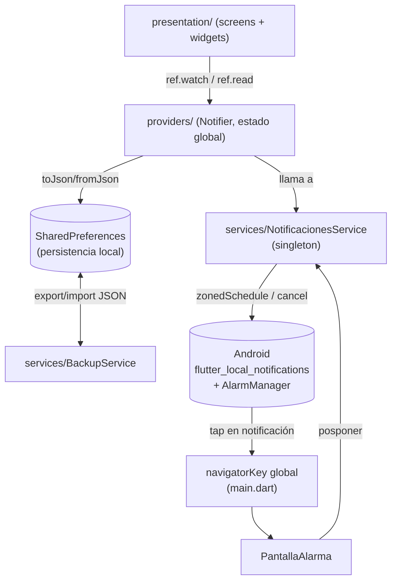

# FocusFlow

App de productividad personal hecha en **Flutter**, con tres módulos: **Tareas** (con urgencia auto-calculada y subtareas), **Rutinas/Hábitos** (con rachas y notificaciones recurrentes) y **Notas** (tipo post-it, con soporte de listas). Funciona 100% offline usando `SharedPreferences` como almacenamiento local, con exportación/importación de respaldos en JSON, y usa `flutter_local_notifications` + `android_alarm_manager_plus` para alarmas confiables en Android incluso con la app cerrada.

- Versión actual: `1.9.13+65` (ver [pubspec.yaml](pubspec.yaml))
- Plataforma principal: Android (permisos y flujo de alarmas están pensados para Android; iOS no está configurado a fondo)

> Este documento se mantiene al día: la sección [Registro de cambios](#registro-de-cambios) al final resume qué se agregó después de la primera versión de esta documentación, por si solo te interesa el delta.

## Stack técnico

| Área | Tecnología |
|---|---|
| Framework | Flutter (Dart SDK ^3.11.1) |
| Gestión de estado | `flutter_riverpod` ^3.3.1 (`Notifier`/`NotifierProvider` en todos los providers) |
| Persistencia | `shared_preferences` (JSON serializado a texto plano, sin base de datos) |
| Respaldo/exportación | `path_provider` + `share_plus` + `file_picker` (exportar/importar un JSON con todos los datos) |
| Notificaciones locales | `flutter_local_notifications` 17.2.1 |
| Alarmas en segundo plano | `android_alarm_manager_plus` |
| Zonas horarias | `timezone` + `flutter_timezone` |
| Permisos | `permission_handler` |
| Reproducción de audio | `audioplayers` (preview de sonidos de notificación/alarma en Configuraciones) |
| Otros | `wakelock_plus` (mantener pantalla encendida en la alarma), `url_launcher`, `flutter_email_sender` (feedback por correo), `uuid`, `intl` |

## Estructura de carpetas

```
lib/
├── main.dart                          # Bootstrap: timezones, notificaciones, ProviderScope
├── models/
│   ├── tarea.dart                     # Modelo Tarea (urgencia calculada + subtareas/checklist)
│   ├── rutina.dart                    # Modelo Rutina (hábito recurrente)
│   └── nota.dart                      # Modelo NotaPostIt (post-it de texto o lista)
├── providers/
│   ├── tarea_provider.dart            # tareaProvider, ordenProvider
│   ├── rutina_provider.dart           # rutinaProvider (orquesta notificaciones + guard de reentrancia)
│   ├── nota_provider.dart             # notaProvider
│   ├── configuracion_provider.dart    # sonidoProvider (sonidos de notificación/alarma)
│   └── tema_provider.dart             # temaProvider + extensión TemaColores (paleta centralizada)
├── services/
│   ├── notificaciones_service.dart    # Único punto de contacto con el SO para notificaciones/alarmas
│   └── backup_service.dart            # Exportar/importar respaldo completo en JSON
└── presentation/
    ├── screens/
    │   ├── home_screen.dart           # Pantalla principal (3 tabs)
    │   ├── gestor_rutinas_screen.dart # Lista/gestión de todas las rutinas configuradas
    │   ├── rutina_form_screen.dart    # Crear/editar una rutina
    │   ├── settings_screen.dart       # Tema, sonidos (con preview), respaldo, feedback, "reparar notificaciones"
    │   └── pantalla_alarma.dart       # Pantalla full-screen que se abre al sonar una alarma
    └── widgets/
        ├── rutina_card.dart           # Tarjeta de una rutina en el tab "Rutinas"
        ├── progreso_rutinas_bar.dart  # Barra de progreso diario de hábitos
        ├── add_tarea_modal.dart       # Bottom sheet para crear/editar tareas (incluye checklist de subtareas)
        ├── feedback_modal.dart        # Bottom sheet de envío de feedback por email
        └── onboarding_permisos.dart   # Diálogo de 3 pasos pidiendo permisos críticos
```

> `alarma_screen.dart`, `add_rutina_modal.dart` y `seccion_notas_rapidas.dart` existían como código muerto en una versión anterior de este repo (no los importaba nadie) y ya **fueron eliminados** del proyecto — ver [Registro de cambios](#registro-de-cambios).

## Arquitectura general

La app sigue una separación por capas simple (no es Clean Architecture estricta, pero respeta el espíritu):



Puntos clave del diseño:

- **No hay capa de "repositorio" separada.** Cada `Notifier` (`RutinaNotifier`, `TareaNotifier`, etc.) lee/escribe directamente en `SharedPreferences` y llama directamente a `NotificacionesService`. Es una arquitectura pragmática de 2 capas (UI + Notifier-como-todo-lo-demás), no 3 capas.
- **`NotificacionesService` es un singleton** (`factory` + instancia estática) y es el único lugar que toca el plugin `flutter_local_notifications`. Todo el resto de la app pasa por él.
- **La navegación al tocar una alarma es global**, vía `navigatorKey` definido en `main.dart` y pasado a `NotificacionesService.init()`. Esto permite navegar incluso si la app fue relanzada desde background por una notificación.
- **Todos los `Notifier` exponen `recargarDesdeDisco()`**, un método que fuerza una relectura completa desde `SharedPreferences` descartando el estado en memoria. Se agregó específicamente para que `BackupService` pueda refrescar la UI justo después de restaurar un respaldo, sin tener que reiniciar la app.

## Modelos de datos

### `Tarea` ([lib/models/tarea.dart](lib/models/tarea.dart))

Tarea puntual con fecha límite opcional. Su campo más interesante es `urgencia`, un **getter calculado** (no almacenado) que decide qué tan urgente es la tarea comparando el tiempo restante hasta `fechaLimite` contra `horasEstimadas`:

| Condición (tiempo restante vs. horas estimadas) | Urgencia |
|---|---|
| `restante <= horasEstimadas` | 4 (MUY ALTO) |
| `restante <= horasEstimadas * 1.5` | 3 (ALTO) |
| `restante <= horasEstimadas * 2` | 2 (MEDIO) |
| resto | 1 (BAJO) |

Si la tarea no tiene `fechaLimite` u `horasEstimadas`, se usa `urgenciaBase` (la urgencia manual elegida por el usuario). Este "auto-piloto" es lo que determina, más adelante, si la notificación de la tarea se muestra en pantalla completa e insistente o como un aviso normal.

Cada `Tarea` también tiene una lista de **`subtareas` (`List<ItemSubtarea>`)** — un checklist de pasos dentro de la tarea (ver [Sistema de subtareas](#sistema-de-subtareas-checklist-dentro-de-una-tarea) más abajo). `ItemSubtarea` tiene su propio `id` estable (UUID), a diferencia de `ItemLista` en `Nota`, porque las operaciones de subtareas (marcar, eliminar, reordenar) necesitan identificar un ítem sin depender de su posición en la lista. `progresoSubtareas` (`(completadas, total)`) y `porcentajeSubtareas` son getters calculados para que la UI no repita el conteo en cada `build()`.

### `Rutina` ([lib/models/rutina.dart](lib/models/rutina.dart))

Hábito recurrente. Campos clave:

- `horarios`: `Map<int, TimeOfDay>` — día de la semana (0 = lunes … 6 = domingo) → hora programada. Permite horario distinto por día (`esFlexible: true`) o un solo horario para varios días.
- `racha`: contador de veces completada consecutivamente.
- `completada` / `fechaCompletada`: si ya se marcó como hecha *hoy*.
- `notificacionesActivas: List<int>`: la lista **exacta** de IDs de notificación de Android actualmente programados para esta rutina. Es el campo central de todo el sistema de anti-alarmas-fantasma (ver más abajo).

`fromJson` tiene retrocompatibilidad con un formato viejo (`diasSemana` + `hora`/`minuto` en vez de `horarios`), para no romper datos guardados por versiones anteriores de la app.

### `NotaPostIt` ([lib/models/nota.dart](lib/models/nota.dart))

Nota tipo post-it, de texto libre o de lista de compras (`TipoNota.texto` / `TipoNota.lista`, con `List<ItemLista>` cuando es lista). Se persiste vía `notaProvider` ([lib/providers/nota_provider.dart](lib/providers/nota_provider.dart)) bajo la clave `lista_notas_postit_v2`. `HomeScreen` la consume directamente desde estos dos archivos — antes existía una clase equivalente duplicada dentro de `home_screen.dart`; esa duplicación ya fue eliminada (ver [Registro de cambios](#registro-de-cambios)).

## Gestión de estado (Riverpod)

| Provider | Tipo | Ubicación | Responsabilidad |
|---|---|---|---|
| `tareaProvider` | `NotifierProvider<TareaNotifier, List<Tarea>>` | tarea_provider.dart | CRUD de tareas y subtareas, limpieza diaria de completadas, dispara notificaciones por tarea |
| `ordenProvider` | `NotifierProvider<OrdenNotifier, TipoOrden>` | tarea_provider.dart | Criterio de orden de la lista de tareas (creación/alfabético/urgencia/fecha) |
| `rutinaProvider` | `NotifierProvider<RutinaNotifier, List<Rutina>>` | rutina_provider.dart | CRUD de rutinas, cálculo de progreso diario, **orquestación completa de notificaciones recurrentes**, guard de reentrancia |
| `notaProvider` | `NotifierProvider<NotaNotifier, List<NotaPostIt>>` | nota_provider.dart | CRUD de notas post-it, persistencia JSON |
| `sonidoProvider` | `NotifierProvider<SonidoNotifier, ConfiguracionSonidos>` | configuracion_provider.dart | Sonido elegido para notificaciones normales y para alarmas urgentes |
| `temaProvider` | `NotifierProvider<TemaNotifier, TemaApp>` | tema_provider.dart | Tema visual activo (4 opciones), persistido por índice |

Todos los `Notifier` cargan su estado inicial de forma asíncrona dentro de `build()` (patrón: `build()` dispara `_cargar...()` y retorna un valor vacío/por defecto mientras tanto; cuando la carga async termina, reasigna `state`). Todos exponen además `recargarDesdeDisco()` para el flujo de restauración de respaldos.

## Pantallas principales

- **`HomeScreen`** — pantalla raíz con `TabBar` de 3 pestañas (Tareas / Rutinas / Notas) y un `FloatingActionButton` contextual que cambia de acción según la pestaña activa. Al primer frame:
  1. Ejecuta **una única vez por instalación** una "limpieza nuclear" (`limpiarTodasLasAlarmasDelSistema`) protegida por la bandera `fantasmas_borrados` en `SharedPreferences`, para borrar alarmas huérfanas de versiones anteriores del sistema de notificaciones.
  2. Limpia tareas completadas del día anterior.
  3. Muestra el onboarding de permisos si es la primera vez.
- **`GestorRutinasScreen`** — lista simple de todas las rutinas configuradas (activas o no), con acceso a editar/eliminar. Es la puerta de entrada a `RutinaFormScreen`.
- **`RutinaFormScreen`** — formulario único para crear y editar rutinas. Soporta dos modos: horario único para varios días (`_diasFijos` + `_horaFija`) u horario independiente por día (`esFlexible: true`). Al guardar, llama a `rutinaProvider.notifier.addRutina()` o `.editarRutina()`.
- **`SettingsScreen`** — tema visual, sonido de notificación/alarma (con **preview reproducible in-app** vía `audioplayers`), sección de **Respaldo** (exportar/importar todos los datos), envío de feedback por correo (`FeedbackModal` + `flutter_email_sender`), y un botón de **"Reparar notificaciones"** que llama a `limpiarTodasLasAlarmasDelSistema()` + `resincronizarTodasLasAlarmas()` como mecanismo manual de auto-reparación si el usuario nota alarmas duplicadas o desincronizadas.
- **`PantallaAlarma`** — pantalla full-screen que se muestra cuando el usuario toca una notificación de alarma (tarea urgente o rutina). Usa `WakelockPlus` para mantener la pantalla encendida, tiene un slider para posponer (5/10/15/30/45/60 min) y un botón "Entendido" que cancela la notificación y navega de vuelta al `HomeScreen` limpiando el stack de navegación. Sus colores ahora vienen de la extensión `TemaColores` (ver [Temas visuales](#temas-visuales)).

## Sistema de rutinas y notificaciones

Esta es la parte más compleja del proyecto. El flujo completo vive repartido entre `RutinaNotifier` (orquestador, en `rutina_provider.dart`) y `NotificacionesService` (ejecutor puro, en `notificaciones_service.dart`).

### Por qué existe `notificacionesActivas`

Versiones anteriores intentaban **recalcular** qué IDs de notificación cancelar a partir de una fórmula (hash del id de la rutina + offsets fijos). Si ese cálculo no coincidía exactamente con el ID usado al programar (por overflow, timing, o cambios de fórmula entre versiones), la cancelación fallaba en silencio y quedaban **alarmas fantasma** sonando indefinidamente.

La solución actual: cada `Rutina` guarda en `notificacionesActivas` la lista **real y exacta** de IDs que quedaron programados en Android la última vez que se ejecutó la gestión de notificaciones. Cancelar deja de ser "adivinar" y pasa a ser "leer la lista y cancelar uno por uno" (`NotificacionesService.cancelarListaDeIds`).

### Dos caminos: reset completo vs. relleno incremental

Hasta la versión anterior, un único método (`_gestionarNotificacionesRutina`) cancelaba y reprogramaba **todo** el colchón de cada rutina activa en cada apertura de la app, sin importar si algo había cambiado. Con varias rutinas activas, eso significaba decenas de llamadas nativas de cancelar/programar en cada arranque — perceptible como lentitud — incluso cuando el colchón todavía tenía semanas de sobra. Ahora la gestión se divide en dos métodos, según si el colchón realmente necesita trabajo o no.

**`_resetCompletoNotificacionesRutina(rutina)`** — el comportamiento histórico, sin cambios de fondo:

1. Cancela **exactamente** los IDs que estaban guardados en `rutina.notificacionesActivas` (sin recalcular nada).
2. Si la rutina quedó inactiva, guarda una lista vacía y termina — no programa nada nuevo.
3. Si está activa, por cada día de la semana en `rutina.horarios`, programa un **"colchón" de 4 semanas** de anticipación (ver siguiente sección) y va acumulando cada ID efectivamente programado.
4. Al final, sobreescribe `notificacionesActivas` con la lista nueva, guarda en `ultimaFechaProgramada` la fecha del occurrence más lejano que quedó programado (el final real del colchón), y persiste el cambio (con `await`).

Se usa en `addRutina`, `editarRutina` y `toggleActiva` — el horario o el estado activo pudieron cambiar, así que hace falta empezar de cero para no dejar notificaciones con datos viejos — y en `resincronizarTodasLasAlarmas` (el botón "Reparar notificaciones", que por definición siempre debe forzar el reset).

**`_rellenarColchonSiHaceFalta(rutina)`** — el camino incremental:

- **a.** Si `rutina.ultimaFechaProgramada` es `null` (rutina creada antes de este campo, o recién restaurada de un respaldo de otro dispositivo — ver [Sistema de respaldo](#sistema-de-respaldo-exportarimportar)), no se sabe qué tan lleno está el colchón real en este dispositivo: se delega a un reset completo, que de paso "siembra" el campo para la próxima vez.
- **b.** Si de `ultimaFechaProgramada` a hoy quedan **2 semanas o más** de colchón, no se hace ninguna llamada nativa — se retorna de inmediato.
- **c.** Si queda **menos de 2 semanas** (incluyendo un colchón ya agotado), se programan **solo** las ocurrencias nuevas necesarias para volver a tener 4 semanas desde hoy, por cada día de `rutina.horarios`, saltando las fechas que ya están cubiertas por lo que sigue programado y vigente. Los IDs nuevos se **agregan** a `notificacionesActivas` (nunca se reemplaza ni se cancela lo existente) y `ultimaFechaProgramada` avanza al nuevo final del colchón.

Se usa en `_cargarRutinas` (cada apertura de la app — el camino caliente que más se beneficia de saltarse trabajo innecesario) y en `toggleCompletada` (completar consume una ocurrencia del colchón, pero no cambia el horario, así que no amerita un reset completo).

### El "colchón" de 4 semanas

Cada notificación se programa como una alarma de **una sola ocurrencia** (ya no se usa `matchDateTimeComponents`, que le pedía a Android reprogramar la alarma automáticamente cada semana — ver comentarios en `notificaciones_service.dart:programarAlertaRutina`). Ese parámetro era la causa raíz de que `cancel()` fallara de forma inconsistente en notificaciones recurrentes.

Como contrapartida, sin reprogramación automática del SO, la "semana siguiente" dependería de que el usuario abra la app o marque algo antes de esa fecha. Para no depender de eso, cada vez que se reprograma una rutina (reset completo o relleno) se busca dejar de una vez hasta **4 ocurrencias consecutivas** de colchón. Con el reset completo eso significa programar las 4 de una sola vez; con el relleno incremental, solo las que falten para llegar a esas 4 semanas desde hoy — ver la sección anterior.

### Esquema de IDs de notificación

Todos los IDs de una rutina derivan de un `baseId` determinístico (hash del `rutina.id`, acotado a `% 100000` para dejar espacio a los offsets):

```
idExactoBase       = baseId + diaDeLaSemana
idDeEstaSemana      = idExactoBase + (semanaDelColchón * 100000)
aviso 1h antes      = idDeEstaSemana + 1000
alarma principal    = idDeEstaSemana
recordatorios extra = idDeEstaSemana + (1|2|3) * 10000               // hasta 3, cada hora después
```

Este espaciado (`× 100000` por semana, `+1000` para el aviso previo, `+10000/20000/30000` para recordatorios) evita colisiones entre todos los tipos de notificación que puede generar una sola rutina, para un mismo día y una misma semana de colchón.

`semanaDelColchón` se calcula distinto según el camino:

- **Reset completo**: siempre `0..3`, recalculado desde cero en cada reset (por eso puede reusar ese mismo rango una y otra vez sin problema — cancela todo antes de volver a programar).
- **Relleno incremental**: no puede reusar `0..3` sin arriesgarse a pisar una ocurrencia que sigue activa (programar dos veces el mismo ID hace que la segunda llamada a `zonedSchedule` reemplace silenciosamente la primera, perdiéndola). En su lugar usa `1000 + (semanas transcurridas desde 2020-01-01 hasta la fecha del occurrence)`, que para cualquier fecha real de la app cae muy por encima del `0..3` del reset. Al ser una función pura de la fecha del occurrence (no de cuándo corre el código), la misma fecha siempre produce el mismo ID, y dos fechas distintas de un mismo día de la semana siempre difieren en al menos una unidad de semana — así que ni dos rellenos sucesivos ni un relleno seguido de un reset completo pueden generar el mismo ID para ocurrencias distintas.

### Cancelación prioritaria al completar

`toggleCompletada` cancela las notificaciones **antes** de tocar el estado o guardar nada, específicamente al *marcar* como completada (no al desmarcar). Esto cierra la ventana de tiempo en la que una alarma podría dispararse mientras el resto de la lógica (racha, persistencia, reprogramación) todavía se está ejecutando.

### Protección contra reentradas (`_idsEnProceso`)

`RutinaNotifier` mantiene un `Set<String> _idsEnProceso` con los IDs de rutina que están, en este momento, en medio de un ciclo de cancelar/reprogramar. `editarRutina`, `toggleActiva` y `toggleCompletada` revisan ese set al entrar y salen tempranamente (`return`) si la misma rutina ya está siendo procesada; si no, se agregan al set y lo liberan en un bloque `finally` al terminar.

**Por qué existe:** sin este guard, dos llamadas concurrentes sobre la misma rutina (por ejemplo, un doble tap accidental en el checkbox de `RutinaCard`) podían entrelazar sus respectivos ciclos de cancelación/reprogramación. Como ambas leen `notificacionesActivas` al inicio y lo sobreescriben al final, la segunda llamada podía pisar el resultado de la primera con una lista de IDs desactualizada, dejando IDs "huérfanos" programados en Android que ya nadie recordaba cómo cancelar — el mismo síntoma de fondo (alarmas fantasma) que motivó todo el rediseño de `notificacionesActivas`, pero causado por concurrencia en vez de por fórmulas de recálculo.

### Flujo de disparo → interacción del usuario

1. `NotificacionesService.programarAlertaRutina` agenda vía `zonedSchedule` con `androidScheduleMode: AndroidScheduleMode.alarmClock` (máxima prioridad/confiabilidad en Android) y un `payload` con formato `alarma|<id>|<titulo>|<body>|<iconoCode>`.
2. Al tocar la notificación, `_manejarNavegacionAlarma` parsea el payload y navega a `PantallaAlarma` usando el `navigatorKey` global — funciona incluso si la app estaba cerrada (`getNotificationAppLaunchDetails`).
3. En `PantallaAlarma`, el usuario puede confirmar ("Entendido", cancela la notificación y vuelve a `HomeScreen`) o posponer (slider de minutos → `NotificacionesService.posponerAlerta`, que cancela la actual y reprograma una nueva).

### Sonido y canales dinámicos

El canal de notificación de Android se construye dinámicamente combinando el tipo (`canalAlarmasId`/`canalRecordatoriosId`) con el nombre del sonido elegido en `sonidoProvider` (p. ej. `canal_alarmas_v4_marimba_alerta`), porque en Android el sonido de un canal de notificación **no se puede cambiar después de creado** — cambiar de sonido implica, en la práctica, usar un canal distinto.

Cada sonido disponible ahora también existe como asset bundleado en `assets/sounds/*.mp3` (además del recurso nativo de Android que usa la notificación real), para que `SettingsScreen` pueda reproducir un preview corto con `audioplayers` antes de que el usuario elija un sonido.

## Sistema de subtareas (checklist dentro de una tarea)

Cada `Tarea` puede tener una lista de pasos (`ItemSubtarea`: `id`, `texto`, `completado`) que se gestiona de forma independiente a la urgencia/fecha límite de la tarea:

- **Edición**: dentro de `AddTareaModal` hay una sección colapsable "Subtareas" con una `ReorderableListView` (arrastrar para reordenar, deslizar para eliminar con `Dismissible`, checkbox para marcar). Los cambios se mantienen en memoria (`_subtareasTemp`) y solo se persisten al presionar "Guardar" del formulario completo, igual que el resto de los campos.
- **Provider**: `TareaNotifier` expone `agregarSubtarea`, `toggleSubtarea`, `eliminarSubtarea` y `reordenarSubtareas`. Ninguno de estos métodos llama a `NotificacionesService` — las subtareas no afectan `urgencia` ni `fechaLimite`, así que no hay ninguna alarma que reprogramar o cancelar al tocarlas.
- **Visualización**: en la tarjeta de tarea (`TareaCard` dentro de `home_screen.dart`), si la tarea tiene subtareas se muestra un badge "`completadas/total`" junto al título y una `LinearProgressIndicator` delgada debajo de la fecha; al expandir la tarjeta aparece el checklist completo.
- **Al completar el último paso pendiente**: la tarea *no* se marca automáticamente como completada ni se le pregunta con un diálogo modal — se muestra un `SnackBar` no bloqueante con una acción "Marcar" que, si el usuario la toca, llama a `toggleTarea`. Es una decisión de diseño deliberada: llegar a 100% de subtareas no implica necesariamente que la tarea completa esté terminada.

`Tarea.fromJson` trata `subtareas` ausente como lista vacía, así que las tareas guardadas antes de esta función siguen cargando sin problema.

## Sistema de notificaciones para tareas

Más simple que el de rutinas: `programarAlertaDefinitiva` (en `NotificacionesService`) calcula hasta 3 notificaciones por tarea a partir de un `idBase = tarea.id.hashCode.abs() % 100000`:

- `idBase` → aviso de "es hora de empezar" (`fechaLimite - horasEstimadas`), solo si hay `horasEstimadas`.
- `idBase + 1` → recordatorio de "queda 1 hora" (`fechaLimite - 60min`).
- `idBase + 2` → aviso de tiempo agotado, en `fechaLimite`.

Si `tarea.urgencia == 4`, ambas notificaciones relevantes usan pantalla completa + sonido insistente; si es `3`, solo pantalla completa sin insistencia; urgencia `1`/`2` son notificaciones normales. Cancelar (`cancelarAlerta`) simplemente cancela los 3 IDs derivados de la fórmula — como las tareas no son recurrentes ni tienen el problema de `matchDateTimeComponents`, no necesitan el mecanismo de lista explícita que sí tienen las rutinas.

## Sistema de respaldo (exportar/importar)

Implementado en [lib/services/backup_service.dart](lib/services/backup_service.dart) y expuesto desde la sección "Respaldo" de `SettingsScreen`.

**Exportar** (`exportarYCompartirBackup`):
1. Lee directamente de `SharedPreferences` todas las claves relevantes (rutinas, tareas, grupos, notas, tema, sonido de notificación, sonido de alarma).
2. Las combina en un único `Map` con metadatos (`version`, `fecha_exportacion`) y lo serializa a JSON.
3. Escribe el JSON a un archivo temporal (`focusflow_backup_<fecha>.json`, vía `path_provider`) y abre la hoja de compartir del sistema (`share_plus`) para que el usuario lo guarde donde quiera (Drive, correo, almacenamiento local, etc.).
4. **Las rutinas se exportan con `notificacionesActivas` vaciado a propósito** (`_decodificarListaSinNotificaciones`): esos IDs de notificación pertenecen al dispositivo donde se generó el respaldo, y no tendrían ningún significado si se restauran en otro teléfono (o incluso en el mismo, tras una reinstalación).

**Importar** (`importarBackup`):
1. Lee y parsea el JSON elegido con `file_picker`; valida que tenga un campo `version` compatible con `_versionBackupActual` (actualmente `1`) — si no, lanza `BackupException` con un mensaje ya listo para mostrarle al usuario (nunca un stacktrace crudo).
2. **Sobrescribe por completo** las claves correspondientes en `SharedPreferences` con los datos del archivo.
3. Llama a `recargarDesdeDisco()` en cada provider afectado (`tareaProvider`, `notaProvider`, `temaProvider`, `sonidoProvider`, `rutinaProvider`) para que la UI refleje los datos importados sin reiniciar la app.
4. Como los `notificacionesActivas` importados están vacíos, termina llamando a `rutinaProvider.notifier.resincronizarTodasLasAlarmas()` para reprogramar todas las alarmas de rutinas **desde cero** en el dispositivo actual.

`SettingsScreen` envuelve ambas operaciones con un diálogo de carga (`_mostrarCargando`) y feedback vía `SnackBar`, y pide confirmación explícita antes de importar (la operación sobrescribe todos los datos actuales sin posibilidad de deshacer).

## Persistencia

Todo vive en `SharedPreferences` como JSON serializado bajo estas claves (las mismas que `BackupService` empaqueta al exportar/importar):

| Clave | Contenido |
|---|---|
| `lista_rutinas_v2` | Lista de `Rutina` |
| `lista_tareas_v1` | Lista de `Tarea` (incluye `subtareas` desde la versión con checklist) |
| `lista_grupos_v1` | Grupos de tareas creados por el usuario (además de "General") |
| `lista_notas_postit_v2` | Lista de `NotaPostIt` |
| `tema_seleccionado` | Índice del `TemaApp` activo |
| `sonido_notificacion` / `sonido_alarma` | Nombres de sonido elegidos |
| `ultimo_dia_limpieza_tareas` | Fecha (ISO, solo la parte de día) de la última limpieza de tareas completadas |
| `fantasmas_borrados` | Bandera de "ya se hizo la limpieza nuclear de alarmas" (una sola vez por instalación) |
| `onboarding_permisos_v1` | Bandera de "ya se mostró el onboarding de permisos" |

No hay backend ni sincronización en la nube: todo es local al dispositivo, salvo el mecanismo manual de exportar/importar un archivo JSON descrito arriba.

## Temas visuales

`TemaApp` (enum en `tema_provider.dart`) define 4 temas: `clasico`, `zenClasico`, `brisaMarina`, `atardecerMinimalista`. La paleta de cada tema vive ahora en una **única fuente de verdad**: la extensión `TemaColores on TemaApp` (en el mismo archivo `tema_provider.dart`), con getters como `colorPrincipal`, `colorFondo`, `degradadoFondo` para las pantallas generales, y `colorFondoAlarma`/`colorTextoAlarma`/`colorAcentoAlarma`/`colorPosponerAlarma` específicos de `PantallaAlarma`. `HomeScreen`, `SettingsScreen` y `PantallaAlarma` consumen estos getters (`temaActual.colorPrincipal`, etc.) en vez de mapear el enum a colores cada una por su cuenta.

## Cómo ejecutar el proyecto

```bash
flutter pub get
flutter run          # requiere un dispositivo/emulador Android conectado
```

La primera vez que se instala en un dispositivo, la app pedirá (vía `OnboardingPermisos`) permisos de notificaciones, alarmas exactas, ignorar optimización de batería, y mostrar sobre otras apps — todos necesarios para que las alarmas de rutinas suenen de forma confiable incluso con la app cerrada o el teléfono en reposo.

## Deuda técnica conocida

`flutter test` corre en verde (ver historial de la rama `chore/limpieza-suite-tests` para la limpieza previa, y `feature/temporizador-rutinas` para el `relojProvider` que dejó determinista el último test que quedaba en rojo).

- **Dos constantes de "colchón objetivo" independientes en `rutina_provider.dart`, candidatas a unificar**: `semanasColchon = 2` dentro de `_resetCompletoNotificacionesRutina` (rama de reset completo) y `semanasColchonObjetivo = 2` dentro de `_rellenarColchonSiHaceFalta` (rama de relleno incremental) son dos literales declarados por separado, hoy con el mismo valor por coincidencia, no porque compartan una fuente. Nada impide que alguien cambie uno sin el otro y las dos ramas queden apuntando a colchones de ancho distinto sin que ningún test lo detecte — el equivalente en producción del bug que `test/rutina_notificaciones_test.dart` tuvo con un literal de "20 días" desalineado tras la reducción de 4 a 2 semanas (ver comentario "BAJADO de 4 a 2 semanas" en el propio archivo). No se unifican ahora porque tocar ese archivo a mitad de la introducción del temporizador por rutina no vale el riesgo; evaluar unificarlas en una sola constante compartida (de archivo o de clase) la próxima vez que se toque el sistema de colchón.

## Registro de cambios

Resumen de lo que se agregó/cambió respecto a la primera versión de esta documentación (pubspec pasó de `1.9.10+62` a `1.9.13+65`):

- **Sistema de respaldo completo** (exportar/importar en JSON): nuevo `lib/services/backup_service.dart`, nueva sección "Respaldo" en `SettingsScreen`, nuevas dependencias `path_provider`, `share_plus`, `file_picker`. Todos los `Notifier` ganaron un método `recargarDesdeDisco()` para soportar la restauración sin reiniciar la app.
- **Subtareas/checklist en Tareas**: nueva clase `ItemSubtarea` en `models/tarea.dart`, nuevos métodos en `TareaNotifier` (`agregarSubtarea`, `toggleSubtarea`, `eliminarSubtarea`, `reordenarSubtareas`), nueva sección colapsable en `AddTareaModal`, y nueva UI de progreso/checklist en `TareaCard`.
- **Preview de sonido en Configuraciones**: nueva dependencia `audioplayers` y assets reales en `assets/sounds/*.mp3`, usados por un reproductor embebido en el diálogo de selección de sonido.
- **Centralización de la paleta de temas**: nueva extensión `TemaColores on TemaApp` en `tema_provider.dart`. `HomeScreen`, `SettingsScreen` y `PantallaAlarma` dejaron de tener cada una su propia copia de la lógica de colores por tema.
- **Eliminada la duplicación del modelo de Notas**: `home_screen.dart` ya no define su propia clase `NotaPostIt`/`NotaNotifier`/`notaProvider`; ahora usa directamente `models/nota.dart` y `providers/nota_provider.dart`. De paso, `nota_provider.dart` migró de `StateNotifier` (API legacy de Riverpod) a `Notifier` (API moderna), quedando consistente con el resto de los providers.
- **Guard de reentrancia en rutinas** (`_idsEnProceso` en `RutinaNotifier`): protege `editarRutina`, `toggleActiva` y `toggleCompletada` contra llamadas concurrentes sobre la misma rutina (p. ej. doble tap), que antes podían dejar IDs de notificación huérfanos por una condición de carrera.
- **Código muerto eliminado**: se borraron del repositorio `alarma_screen.dart`, `add_rutina_modal.dart` y `seccion_notas_rapidas.dart` (ninguno estaba referenciado desde ningún otro archivo). También se quitó un `Text` de depuración en `RutinaCard` que mostraba en pantalla los IDs de `notificacionesActivas`.
- Ajustes menores: `GestorRutinasScreen` ahora espera (`await`) a que `eliminarRutina` termine antes de continuar; en `RutinaNotifier`, el guardado de `notificacionesActivas` y de `toggleCompletada` ahora se espera con `await` en vez de ser "fire-and-forget", para acotar la ventana de desincronización si la app se cierra abruptamente.
- **Top-up incremental de notificaciones de rutinas** (optimización de lentitud al abrir la app): nuevo campo `ultimaFechaProgramada` en `Rutina`. `_gestionarNotificacionesRutina` se dividió en `_resetCompletoNotificacionesRutina` (el reset completo de siempre) y `_rellenarColchonSiHaceFalta` (solo cancela/reprograma cuando el colchón de 4 semanas realmente lo necesita — ver [Dos caminos: reset completo vs. relleno incremental](#dos-caminos-reset-completo-vs-relleno-incremental)). `_cargarRutinas` y `toggleCompletada` ahora usan el camino incremental; `addRutina`, `editarRutina`, `toggleActiva` y `resincronizarTodasLasAlarmas` siguen forzando el reset completo. `BackupService` también limpia `ultimaFechaProgramada` al exportar, igual que ya hacía con `notificacionesActivas`.
